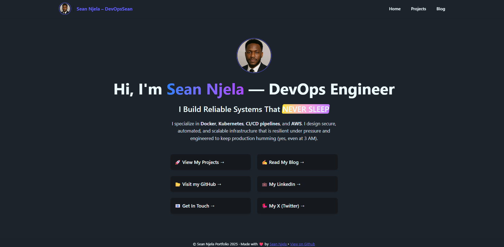
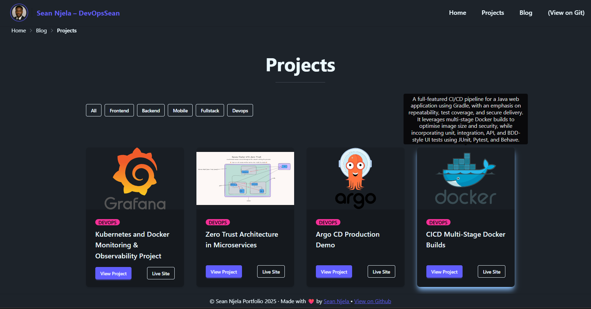
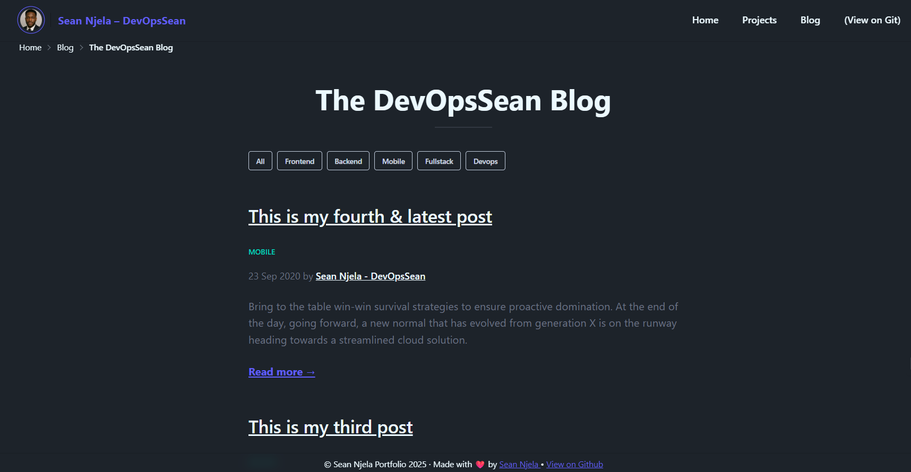

<div align="center">

  <!-- Optional logo -->
  <!--  -->

  <h1>📘 My Developer Portfolio</h1>

  <p>
   This is the full code to my Developer Portfolio Built with <strong>N</strong>etlify CMS, <strong>E</strong>leventy, <strong>A</strong>lpine JS & <strong>T</strong>ailwind CSS
  </p>

  <p>Visit the  <a href="https://devopssean.netlify.app/"> ▶ <strong> LIVE SITE </strong> ◀</a></p>

  <p>
    <a href="https://github.com/sean-njela/neat-starter/graphs/contributors">
    
  </a>
  <a href="">
    
  </a>
  <a href="https://github.com/sean-njela/neat-starter/network/members">
    
  </a>
  <a href="https://github.com/sean-njela/neat-starter/stargazers">
    
  </a>
  <a href="https://github.com/sean-njela/neat-starter/issues/">
    
  </a>
  <a href="https://github.com/sean-njela/neat-starter/blob/master/LICENSE">
    
  </a>
  <a href="https://app.netlify.com/projects/devopssean/deploys">
    
  </a>
  </p>

</div>

## 📚 Table of Contents

  * [Screenshots](#screenshots)
  * [Tech Stack](#tech-stack)
  * [Prerequisites](#prerequisites)
  * [Quick Start](#quick-start)
  * [Documentation](#documentation)
  * [Tasks (automation)](#tasks)
  * [License](#license)
  * [Contributing](#contributing)
  * [Contact](#contact)

---

## 📸 Demo
<a href="https://devopssean.netlify.app">
<div align="center"> 
  
  
  
</div>
</a>

<!-- 
[](https://devopssean.netlify.app/) -->

---

## 🛠️ Tech Stack

> List of tools used in the project


---

## 📋 Prerequisites

> This project uses [Devbox](https://www.jetify.com/devbox/) to manage the development environment. Devbox provides a consistent, isolated environment with all the necessary CLI tools pre-installed. 

0. **Install Node**

   - Follow the [installation instructions](https://nodejs.org/en/download) for your operating system.

> The rest of the tools are already installed in the devbox environment

1. **Install Devbox**

   - Follow the [installation instructions](https://www.jetify.com/devbox/docs/installing_devbox/) for your operating system.

2. **Clone the Repository**

   ```bash
   git clone https://github.com/sean-njela/neat-starter.git
   cd neat-starter
   ```

3. **Start the Devbox Environment and poetry environment**

   ```bash
   devbox shell # Start the devbox environment (this will also start the poetry environment)
   poetry install # Install dependencies
   poetry env activate # use the output to activate the poetry environment ( ONLY IF DEVBOX DOES NOT ACTIVATE THE ENVIRONMENT)
   ```
> Note - The first time you run `devbox shell`, it will take a few minutes to install the necessary tools. But after that it will be much faster.

---

## 🚀 Quick Start

```bash
pnpm install

task dev # this one command will run all commands necessary to setup the environment. yes, really.
```

The command also starts the local CMS at [localhost:8080/admin]()

---
## 📚 Documentation

For full documentation, setup instructions, and architecture details, visit the [docs](docs/0-index.md) or run:

```bash
task docs
```

Docs available at: [http://127.0.0.1:8000/](http://127.0.0.1:8000/)

<!-- ---

## 📂 Features

* Feature 1
* Feature 2
* Feature 3 -->

---

## ✅ Tasks (Automation)

> This project is designed for a simple, one-command setup. All necessary actions are orchestrated through `Taskfile.yaml`.

<!-- ```bash
task setup # setup the environment
task dev # automated local provisioning
task cleanup-dev # cleanup the dev environment
``` -->

### Git Workflow with Git Flow

The `Taskfile.gitflow.yaml` provides a structured Git workflow using Git Flow. This helps in managing features, releases, and hotfixes in a standardized way. To run these tasks just its the same as running any other task. Using gitflow is optional.

```bash
task init                 # Initialize Git Flow with 'main', gh-pages and 'develop'
task sync                 # Sync current branch with latest 'develop' and handle main updates
task release:finish       # Finishes and publishes a release (merges, tags, pushes). e.g task release:finish version="1.2.0"
```

To see all tasks:

```bash
task --list-all
```

If you do not want the gitflow tasks, you can remove the `Taskfile.gitflow.yaml` file and unlink it from the `Taskfile.yaml` file (remove the `includes` section). If you cannot find the section use CTRL + F to search for Taskfile.yaml.

---

## 📝 NOTES

> Important notes to remember whilst using the project

---

<!-- ## 📚 Troubleshooting

For comprehensive troubleshooting, refer to the [Troubleshooting](docs/3-troubleshooting/overview.md) section. Or open the github pages [here](https://your-username.github.io/docs/3-troubleshooting/overview.md) and use the search bar to search your issue (USE INDIVIDUAL KEYWORDS NOT THE ISSUE NAME). 

---

## 🛣️ Roadmap

* [x] Feature A
* [ ] Feature B
* [ ] Feature C

--- -->

## 🤝 Contributing

<a href="https://github.com/sean-njela/neat-starter/graphs/contributors">
  
</a>

> Contributions welcome! Open an issue or submit a PR.

---

## 📄 License

Distributed under the MIT License. See `LICENSE` for more info.

---

## 📬 Contact

Sean Njela – [@linkedin](https://linkedin.com/in/sean-njela) – [@twitter/x](https://x.com/devopssean) – [seannjela@outlook.com](mailto:seannjela@outlook.com)

Project Link: [https://github.com/sean-njela/neat-starter](https://github.com/sean-njela/neat-starter)

About Me - [About Me](docs/4-about/about.md)

---
